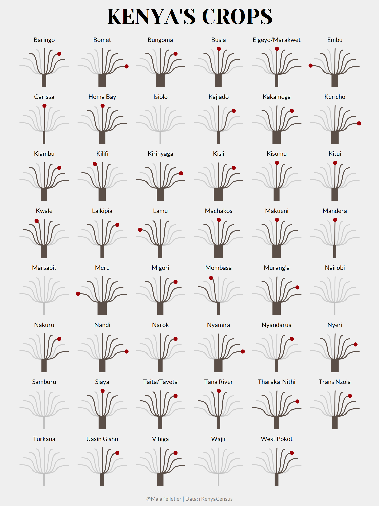
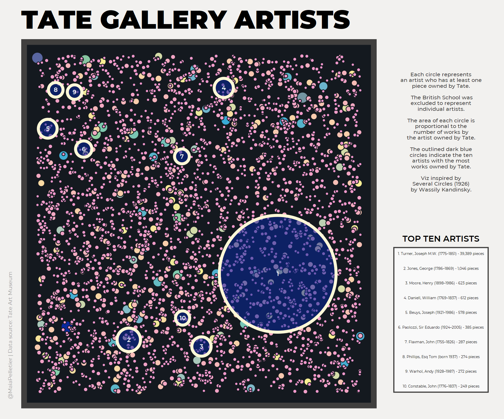
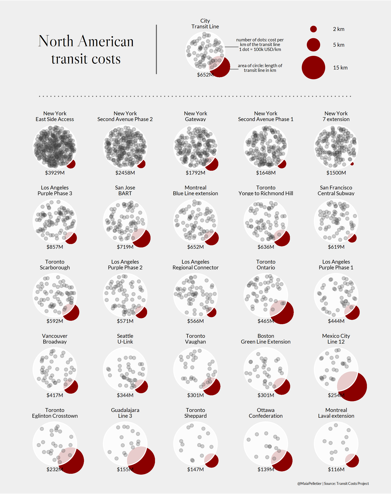
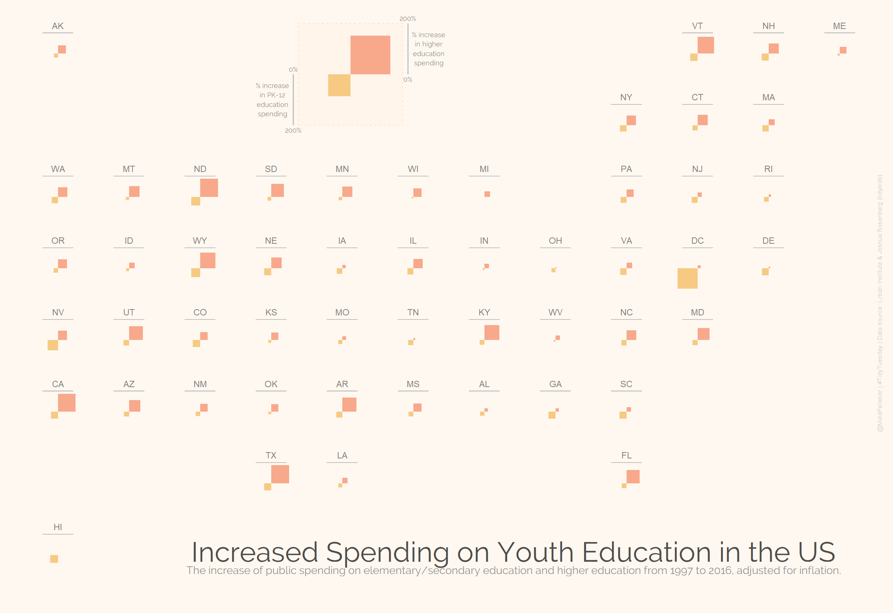
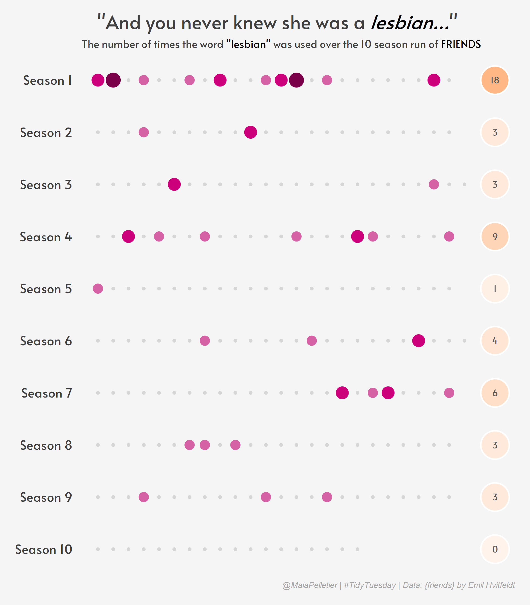
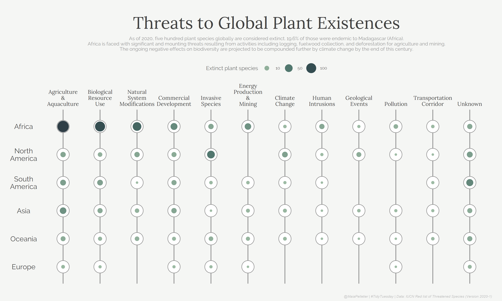
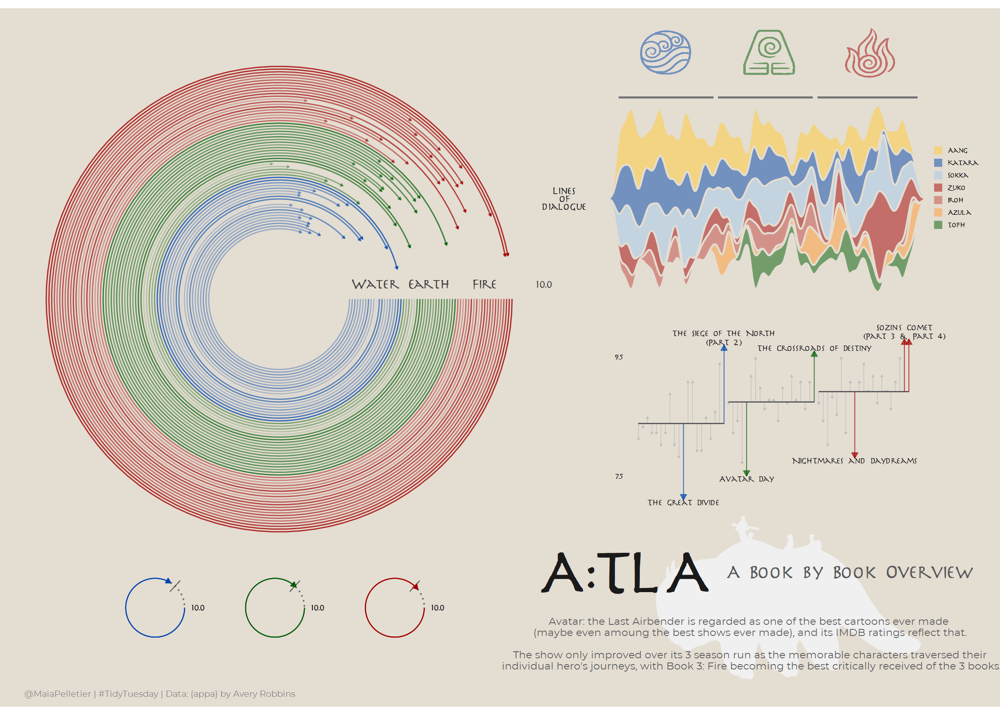
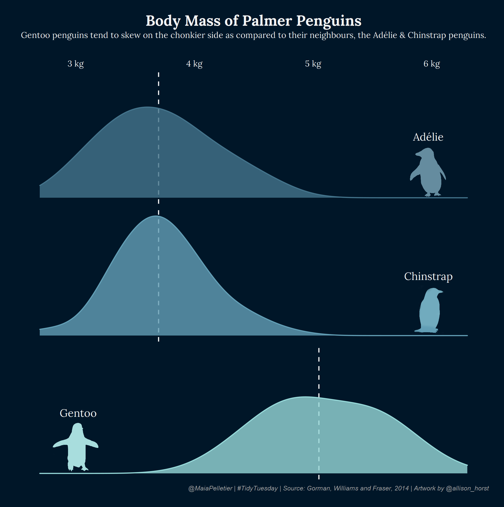
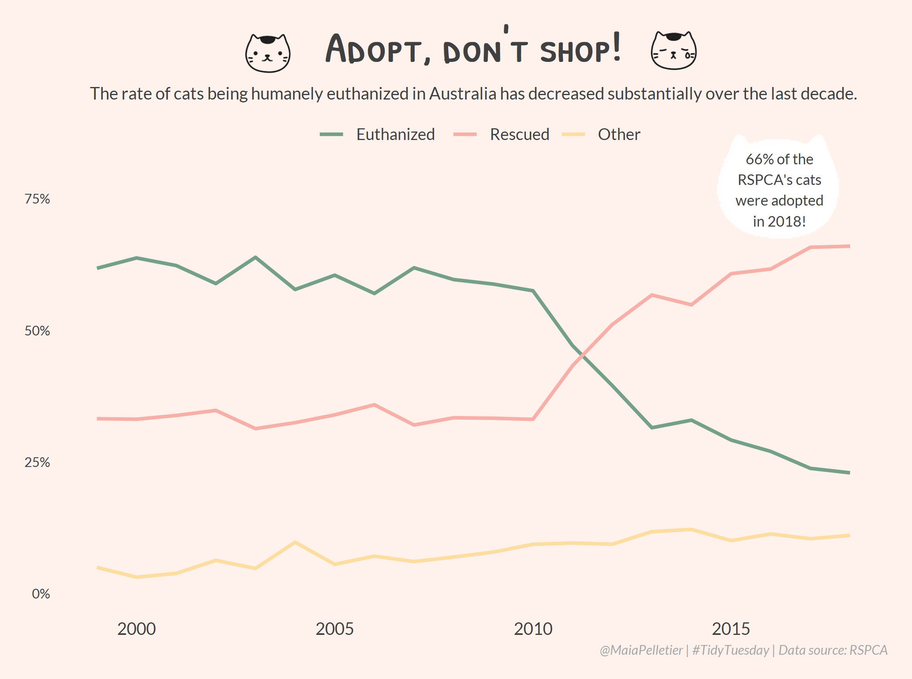

\#TidyTuesday
================

This repository hosts all my contributions to
[\#TidyTuesday](https://github.com/rfordatascience/tidytuesday), a
weekly data project in R.

Below are some of my favourite contributions.

## 2021 Week 4: 

## 2021 Week 3:

## 2021 Week 2:

## 2020 Week 49:

## 2020 Week 38:

## 2020 Week 37:

## 2020 Week 34: 

## 2020 Week 33:

## 2020 Week 31:

## 2020 Week 30:

